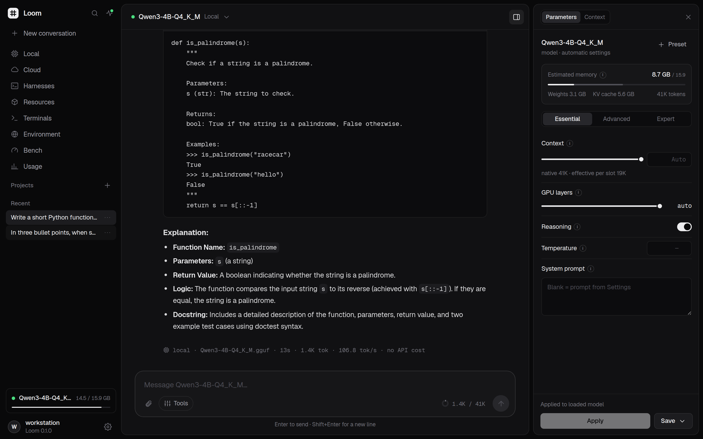
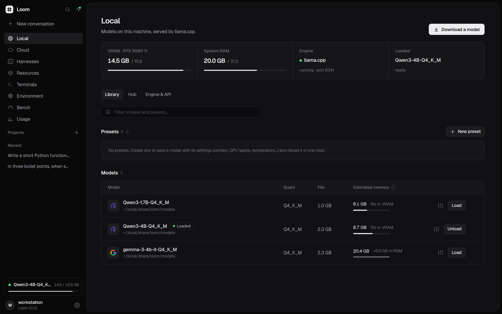
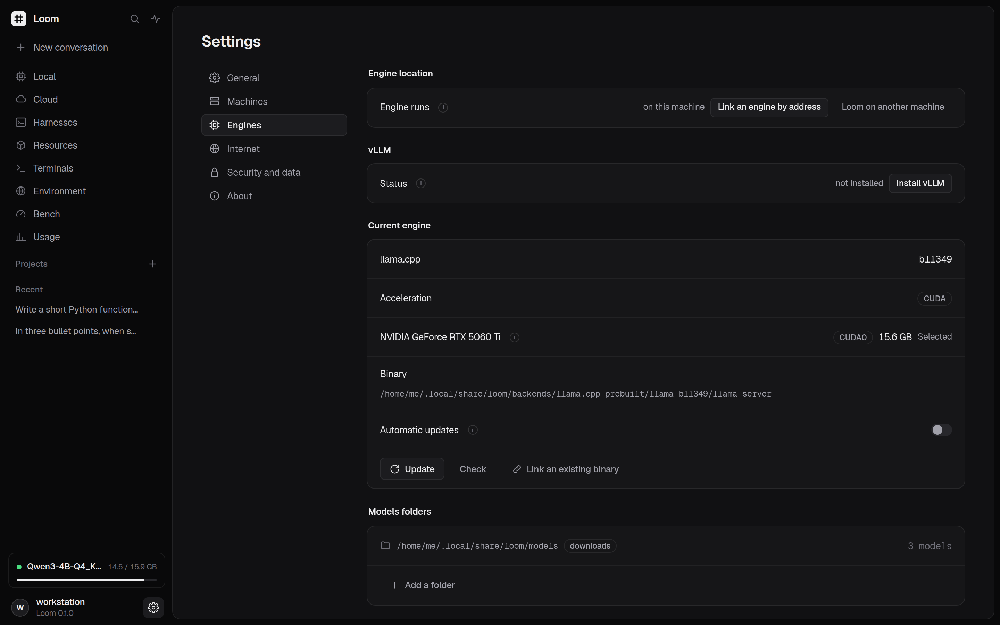
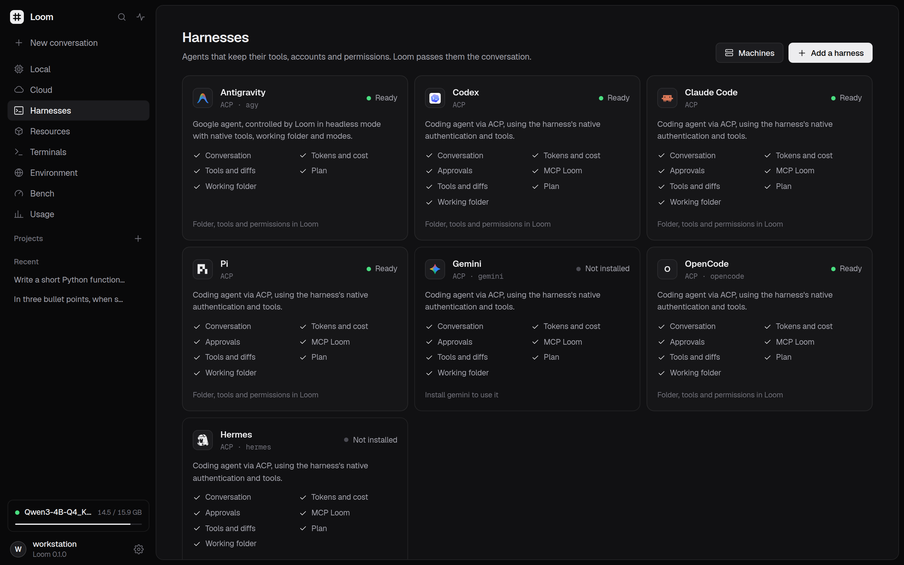
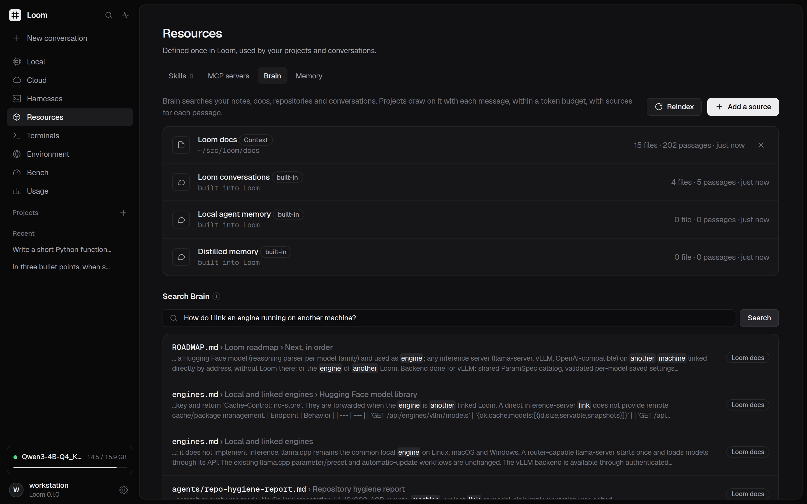
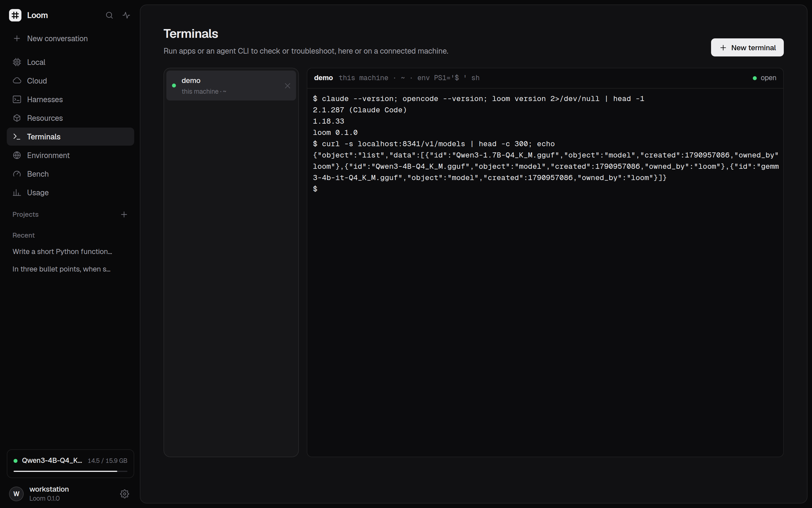
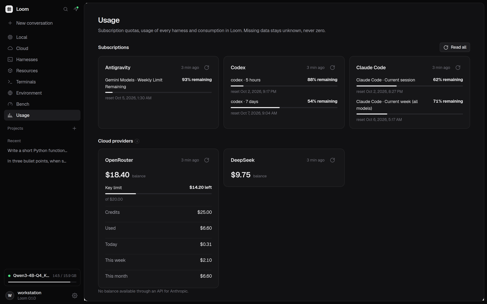
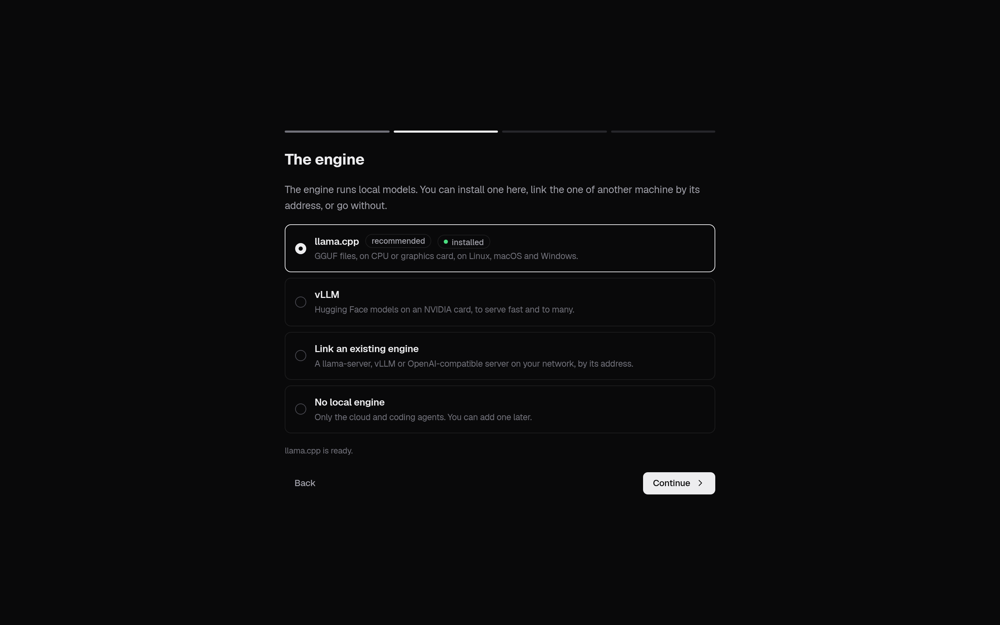

<div align="center">
  <picture>
    <source media="(prefers-color-scheme: dark)" srcset="docs/brand/loom-mark-light.svg" />
    
  </picture>
  <h1>Loom</h1>
  <p><strong>A local AI control station for models, coding agents and shared discussions.</strong></p>
  <p><a href="LICENSE">MIT license</a> · <a href="docs/ROADMAP.md">Roadmap</a> · <a href="CONTRIBUTING.md">Contributing</a></p>
  
</div>

Loom is a single Go binary with a web UI. Run local inference, connect cloud providers or use coding-agent harnesses in the same discussion. The interface defaults to English; French is available in Settings and the first-run guide. On phones, Settings opens a section menu with a back link; model selection, Bench and Usage adapt to the available screen width.

Local speech management (Jarvis 6.1) uses sherpa-onnx 1.13.8 on this machine
or a paired node's `voice` module. It provides verified engine/model downloads,
curated packs, supervised STT/TTS, Doctor and a streaming API for browser voice.
Voice requires Python 3; missing catalog hashes refuse installation. See
[voice engine and API contracts](docs/voice.md). The Models › Voix UI is a
separate slice. Jarvis 6.2 adds isolated voice-session text streaming and optional
message-only injection into the originating discussion. Optional HTTPS on port
2543 shares Loom authentication and supports sealed self-signed or existing PEM
certificates for secure browser microphone access. The browser voice view is
built separately; exact API contracts are in the voice documentation.
Jarvis 6.3 adds a saved spoken profile (name, language, personality, length,
French formality and context), plus Jarvis-only TTS overrides. Idle engine
configuration changes restart resident speech workers. Kokoro/Piper deliver
audio after each native sentence batch; a single long sentence still waits for
synthesis, and the benchmark reports the measured first PCM separately.

## Why Loom

- Keep a discussion and its project context when switching models or harnesses.
- Manage engines, model libraries and parameters without rebuilding the inference stack.
- See native tools, permissions, usage and machine state in one workspace.
- Keep data locally and choose when to share it with an external destination.

The backend also offers the official ACP agent catalogue with pinned add/remove
configuration and an offline snapshot, plus curated Hermes, OpenClaw and
the official DeepSeek Harness developer preview. See [agent compatibility](docs/agents-compat.md) for API
shapes, verification limits and the weekly compatibility watch. The watch
compares native schemas and no-account capability snapshots, includes bounded
release notes for new versions, publishes review PRs alongside attention issues,
and dispatches CI. Refresh local snapshots with
`make agents-watch AGENTS_WATCH_ARGS=--update-capabilities`.

## Models and engines

Install, compile or update **llama.cpp** from Loom, or link an existing binary. Engine updates also repair unhealthy builds at the current commit; the Engine page shows observed acceleration and offers **Rebuild** for unhealthy source installations. See [engine repairs](docs/engines.md#repairing-llamacpp-acceleration). Router mode keeps the engine running while models load through its API. Browse and download GGUF models from Hugging Face, save presets and tune per-model parameters with an advisory VRAM estimate.



Install **vLLM** in a Loom-managed Python environment on Linux with supported NVIDIA CUDA or AMD ROCm hardware. **Local** then switches between llama.cpp and vLLM: a Hugging Face model library, search with a VRAM estimate, downloads, per-model settings and start/stop; Settings › Engines handles install and idle updates. Drivers must already be installed; AMD installation requires `uv`.

Link a running **llama-server, vLLM or OpenAI-compatible server** by address, with no Loom installation required on that machine. Link **another Loom's engine** to manage its models and engine remotely. Direct server links provide inference; package and file management stay on the server's machine. See [engines](docs/engines.md).



**Cloud** connects Chat Completions-compatible providers, retrieves their model catalogs on request and controls model visibility. Keys can be remembered in the OS keychain. Catalog discovery does not guarantee that every listed model supports chat.

## Coding agents and projects

Run local **Codex** through its installed app-server and **Pi** through native RPC,
with pinned ACP fallbacks for older CLIs. **Claude Code** uses pinned ACP with native questions/forms and plan approvals;
**OpenCode** prefers its authenticated local HTTP/SSE server, with ACP fallback
for older CLIs and launch-scoped Loom sources. **Antigravity** uses Loom's own
bridge; **Hermes** and **OpenClaw** use native ACP. [Agent compatibility](docs/agents-compat.md) documents canonical events,
durable interaction requests and tested protocol versions. **Antigravity** uses
Loom's ACP bridge to its native CLI. Any other ACP agent can be added with a
custom launcher. Harnesses can run locally or on paired Loom Node machines (and existing SSH machines),
with installation and update controls where the lifecycle catalog supports them.

Installation, native account sign-in and connecting a harness to Loom are separate.
Agents' **On your machines** table checks, installs and updates local, paired
Node and existing SSH installations. Updates follow the detected npm, native
installer or Homebrew channel; unknown installations require manual updates.
Missing launchers with known installations offer **Repair**. npm updates preserve the installation
prefix and verify a staged replacement before promotion, with rollback on
failure. Antigravity offers **Check and update** through `agy update`; unknown
versions never imply **up to date**. See [agent lifecycle](docs/agents-compat.md#installation-and-update-lifecycle).

Account setup stays in the Harnesses page. Codex offers ChatGPT device-code login;
Claude Code and Antigravity expose their native browser sign-in links and accept
the returned code directly in Loom. Other native flows keep a terminal fallback.
Credentials stay with the CLI. See [native account connection](docs/agents/acp-implementation.md#native-account-connection).


Save named folders and one default per execution machine in **Settings › Workspaces** or the first-run guide. New harness discussions use that default, with project folders taking precedence. The Session panel can select another saved folder or save a new one. [Workspaces and native access](docs/workspaces.md) explain the supported file protections, approvals and native account login. Harness installation, Loom connection and account sign-in are separate; the selector includes only connected harnesses. Antigravity is the built-in Google harness. Gemini CLI is no longer offered; saved discussions and native installations are preserved.

Follow native tools, diffs and plans, answer permission requests and import or resume supported native sessions. Agent options come from the active transport capability descriptor; unsupported modes, policies and native-history actions are hidden. **Native / Loom** model sources let supported harnesses use their own account or compatible Loom models/providers. This depends on the harness protocol: Antigravity keeps its native catalog, and Hermes uses its own machine configuration.

Projects link folders on this machine or a connected machine, with shared instructions, selected context files, skills, MCP servers and a default execution target. Only explicitly selected local context files are read for prompts. See [workspace contracts](docs/workspace-architecture.md) and [ACP integration](docs/agents/acp-implementation.md).



Workspace discussions expose estimated or agent-reported context usage through
the backend API. Compaction keeps the display history and uses the discussion's
chosen model or an advertised agent command. A continuation can start in the
same project or create one, retaining a link to the predecessor transcript. See
[context limits and compaction](docs/workspace-architecture.md#context-limits-and-compaction)
for API shapes and the automatic `COMPACT` setting.

## Brain and shared context

Discussions freeze their system context at the first accepted turn and reuse it
until static configuration changes or compaction. Local/Cloud retrieval is added
only to the outgoing message; ACP agents use Loom MCP memory tools.
`POST /api/runtime/sessions/refresh-context {"id":"discussion-id"}` invalidates
the snapshot for the next turn. See the [frozen snapshot contract](docs/brain.md#frozen-discussion-snapshot).

**Brain** searches local sources with BM25 and builds cited context within a token budget. Optional semantic search uses a local CPU embedding model or a connected provider with explicit consent. Distillation extracts decisions, facts, todos and preferences on request, with links back to source messages and individual deletion.

Developers can run the [free offline retrieval benchmark](docs/brain-retrieval-benchmark.md)
with `sh tools/brain-retrieval/run.sh`: evidence recall, final prepared-context
presence and a fixed CI regression baseline, with zero model calls.

Memory lives as native Markdown in the primary second brain: global `Memory/`,
project `Projects/<slug>/memory/`, each with a bounded `MEMORY.md` index. Loom
writes verbatim discussions under `Discussions/` and consolidates paused work
with one background model call, using the discussion route or an explicitly
configured fallback. Frozen context contains indexes, a bounded user profile
and first-message topic matches. HTTP/MCP tools maintain the same files agents
can edit directly; the encrypted fallback remains available. See the
[memory format and APIs](docs/brain.md#markdown-memory-in-the-primary-brain) and
[consolidation settings](docs/brain.md#background-memory-consolidation).

Select Brain sources for a project or expose its authenticated MCP tools to harnesses at **`/mcp/brain`**. Loom must remain running; the browser can be closed. Personal sources require explicit selection and opt-in. See [Brain](docs/brain.md) and [MCP configuration](docs/mcp-files.md).

Native agents can also read and write shared Markdown memory outside Loom after
an explicit `POST /api/brain/agents` opt-in. Claude Code uses native auto-memory
settings; Codex, OpenCode, Antigravity and documented Pi installations receive
marked global instructions. See [Agents linked to the brain](docs/brain.md#agents-linked-to-the-brain).

External Claude Code, Codex, OpenCode and Antigravity sessions can use one `loom` MCP entry at **`/mcp/loom`** for Brain, memory and all enabled Loom MCP servers. Explicit registration and token rotation use `/api/mcp/gateway` and `/api/mcp/gateway/token`; the dedicated gateway token cannot access control APIs. Secret-free MCP definitions travel with the primary Brain in `.loom/mcp.json` and import disabled. See [gateway and portable MCP APIs](docs/brain.md#one-loom-mcp-gateway-per-harness).



## Terminals and environment

Open real terminals through **PTY** on Linux/macOS or **ConPTY** on Windows, locally, over SSH or through a paired node’s terminal module. Sessions survive closing a browser tab and replay recent output while Loom is running. Resume a supported harness's native session in a terminal on its machine. See [terminals](docs/terminals.md).



**Environment** tracks declared services, checks reachability from Loom and connected machines, observes Docker containers per machine with opt-in, and reads Proxmox resources with a token in the OS keychain. Self-signed certificates require explicitly confirmed pinning. See the [Environment API](docs/architecture.md#environment-api-roadmap-step-6).

## Usage, benchmarks and API

**Usage** separates retained Loom token counts, subscription quotas, native harness activity inside and outside Loom, and cloud balances where providers expose them. Missing values stay unknown; manual-price estimates are not invoices. See [native usage](docs/harness-usage.md) and [provider balances](docs/usage.md).

The discussion picker distinguishes direct Local execution from a harness using
the same model. Selecting Local returns the same discussion to direct inference;
loading a model in the engine library only changes the engine's state.



**Web search** connects DuckDuckGo, your own SearXNG, Brave Search or Tavily in
Settings › Internet. Local models retain Go/Crawl4AI page reading; cloud models
with function-call support can use the opt-in search tool. See [web search](docs/web-search.md).

**Bench** compares local engines, configured cloud APIs and supported native-account models with the same prompt, without tools or project context. Claude Code supports a guarded model-only mode; other native adapters remain explicitly unavailable when tool suppression is not guaranteed. Results retain responses and distinguish engine timings from API/CLI observations. See [Bench](docs/bench.md). The **OpenAI-compatible `/v1` server** exposes `/v1/models` and `/v1/chat/completions` for other applications; local router requests use native slots and temporary parameter overrides without changing saved settings. [Engine service](docs/engines.md#engine-as-a-service) adds stream-safe model swaps, background priorities, idle VRAM unload and named API keys with limits and usage.

The UI also provides a **PWA** shell where the browser supports installation. HTTPS is required outside loopback. Offline mode shows a public fallback; it does not provide offline inference or queue messages.

The unreleased Tasks/Notifications backend keeps harness work and pending approvals running with every browser closed. Opt-in ntfy actions can answer an offered choice from a phone; webhooks and secure-context Web Push observe task events. All channels default off. See [notifications](docs/notifications.md) for setup and the Tasks/Settings UI API contracts.

The phase 4b backend adds [central capability policy](docs/policy.md), canonical confirmations and a bounded audit, plus [Loom Doctor](docs/doctor.md), degraded feature fields and opt-in redacted support bundles. These documents include the exact API contracts for the separate Settings and Doctor UI work.

## Install

The installers download a matching GitHub release binary and verify `SHA256SUMS.txt`. They require published assets; if none are available, build from source. Linux/macOS installation also configures system services and requires root or `sudo`. Review [install.sh](install.sh) or [install.ps1](install.ps1) before running it.

Linux / macOS:

```sh
curl -fsSL https://raw.githubusercontent.com/lucas-lepajollec/loom/main/install.sh | sh
```

Windows (PowerShell):

```powershell
irm https://raw.githubusercontent.com/lucas-lepajollec/loom/main/install.ps1 | iex
```

To build from source, install Go 1.26.8+ and GNU Make. The web UI is embedded directly, with no Node build step. macOS's native menu-bar build also requires a C toolchain; `CGO_ENABLED=0` builds the CLI/web interface without that icon.

```sh
git clone https://github.com/lucas-lepajollec/loom.git
cd loom
make build
./bin/loom web 2510
```

Local inference needs an engine: install one from Loom or link an existing server. Compiling llama.cpp requires Git, CMake and a C/C++ toolchain.

## Quick start

1. Run `loom web 2510` (or `./bin/loom web 2510` after a source build).
2. Open [http://localhost:2510](http://localhost:2510).
3. Follow the first-run guide: choose a language, review detected hardware, choose the default workspace, install or link an engine, or continue with cloud/harnesses only. The llama.cpp path offers a first GGUF model sized to available memory; vLLM models are managed in **Local**.
4. Create a discussion and choose its execution target. Confirm external sharing when prompted. Attach a project when you need a working folder or shared context.

Reopen the guide from **Settings › About**. The guide currently offers vLLM only on detected Linux/NVIDIA systems; supported AMD/ROCm setups install it from **Settings › Engines**.



## Development previews and second brains

To test the current checkout on a phone before a release, use `make dev` with
isolated development data, then `make dev DEV_HOST=<computer-LAN-address>` after
setting a development access password. Restart the command and reload after
source edits; no commit or release is required. See [phone testing](CONTRIBUTING.md#test-uncommitted-changes-from-a-phone).

**Terminals › Application previews** opens an HTTP development server on Loom or a saved SSH machine, including assets and WebSocket/HMR, through a separate authenticated browser origin. VM clients must be able to reach the preview listener; HTTPS setups need a separate preview origin. See [development previews](docs/development-previews.md).

**Brain** brings sources/context, memory, skills and MCP together. Link multiple second brains from folders, Git checkouts, Obsidian vaults or already mounted WebDAV directories. Sources remain canonical and are read-only; Brain indexes selected text with provenance. Include/exclude rules and explicit personal-source opt-in control retrieval. Direct remote synchronization is not implemented. Skills can live in the primary second brain and reach harnesses through managed links or read-only Brain MCP tools. See [Brain](docs/brain.md).

## Configuration

- Use **Settings** for engines, machines, network access, vault, snapshots and language; use **Cloud** and **Harnesses** for their connections and resources.
- `loom where` shows resolved paths; `loom edit` edits engine configuration. `LOOM_HOME` selects the data root. Defaults follow `/etc/default/loom` when present, then XDG/`~/.local/share/loom` on Unix; Windows uses `%ProgramData%\loom` with platform fallbacks.
- Configuration, discussions and preferences live in `LOOM_HOME/loom.db`. Models can live in selected external folders. MCP definitions live in editable `LOOM_HOME/mcp.json`; see [MCP files](docs/mcp-files.md).
- `.env.local` and `.env` in the current working directory fill unset variables; exported values take precedence. Keep local development data in ignored `.project-local/`.

## Platform support

Release assets target x86-64 and ARM64 on all three platforms. Availability is separate from real-platform acceptance; consult the [roadmap](docs/ROADMAP.md) for remaining checks.

| Capability | Linux | macOS | Windows |
| --- | --- | --- | --- |
| Loom CLI and web UI | Yes | Yes | Yes |
| Local llama.cpp | Yes, backend-dependent CPU/GPU support | Yes, including Metal where supported | Yes, backend-dependent CPU/GPU support |
| Local vLLM | Supported NVIDIA CUDA / AMD ROCm GPUs only | Link a remote server | Link a remote server |
| Local terminals | PTY | PTY | ConPTY: Windows 10 1809+ / Windows 11 |
| SSH machines and remote engines | Yes, with SSH client for harnesses/terminals | Yes, with SSH client for harnesses/terminals | Yes, with SSH client for harnesses/terminals |

Harness availability also depends on the native CLI, adapter launcher, account and upstream OS requirements.

## Privacy and security

Loom binds to loopback by default and adds no telemetry. Local model inference and BM25 search stay on the machine running their engine. Discussions and project definitions are stored in Loom's data directory.

External selection requires confirmation before sharing the portable transcript and selected context. A cloud provider receives that text; a remote engine receives inference requests; a harness receives context and access to its chosen working folder under its native permissions. Shared text can include earlier replies. Private reasoning, approvals and tool state do not become portable context.

Network access also occurs for requested model/catalog downloads, installs, updates, account reads, service checks and enabled tools/MCP servers. Opt-in automatic updates check upstream sources. Cloud semantic indexing sends selected source text and search queries after stored consent; remote distillation requires consent before sending discussion text.

Set an **access password** in Settings → Security and data to sign in from other devices. The browser uses an HttpOnly session cookie; no control key needs to be copied between devices. Existing control keys remain supported for automation and remote-engine links, separately from the `/v1` inference key. Network exposure requires a password or existing control key; use TLS for remote access. See [Interface access](docs/access.md) for migration, password changes and local recovery with `loom password`. The optional **vault** encrypts supported Loom stores and blocks access while locked. Cloud provider keys remain in memory unless explicitly remembered in the **OS keychain or encrypted server store**; they are not stored in provider records or browser storage. External files and native harness stores retain their own security rules. See [SECURITY.md](SECURITY.md).

Update Loom from **Settings → About → Updates** using official GitHub releases, verified checksums and a retained previous binary. Linux system installations support a scoped updater and UI restart after one-time administrator setup; see [Updating Loom](docs/updates.md). A source push becomes available to installed users only after a release is published.


Antigravity's builtin harness prefers the installed `agy` structured stream,
retaining Loom's ACP bridge for older CLIs. Native conversation IDs resume with
`--conversation`; headless permissions/questions follow native policy and have
no interactive reply channel. See [agent compatibility](docs/agents-compat.md).


## Documentation

- [Engines and vLLM](docs/engines.md) · [Terminals](docs/terminals.md)
- [Workspaces and native access](docs/workspaces.md) · [Development previews](docs/development-previews.md)
- [Brain and context](docs/brain.md) · [MCP files](docs/mcp-files.md)
- [Provider balances](docs/usage.md) · [Harness quotas and native usage](docs/harness-usage.md)
- [Interface languages](docs/i18n.md)
- [Architecture principles](docs/architecture-principles.md) · [Architecture](docs/architecture.md) · [Workspace contracts](docs/workspace-architecture.md)
- [Product vision](docs/VISION.md) · [Roadmap](docs/ROADMAP.md) · [Changelog](CHANGELOG.md)
- [Browser demo setup](demo/README.md) — a fictional simulation, without inference

## Contributing and license

See [CONTRIBUTING.md](CONTRIBUTING.md) for development and checks, [SUPPORT.md](SUPPORT.md) for bug reports, and [CODE_OF_CONDUCT.md](CODE_OF_CONDUCT.md) for community expectations. Release maintainers use [RELEASING.md](RELEASING.md).

Loom is licensed under the [MIT License](LICENSE). Engines, models and other dependencies retain their own licenses and terms.

### Add a machine

Open **Machines › Add a machine**, install **Loom Node** on the other Linux
machine, then enter the address and pairing code it shows:

```sh
curl -fsSL https://raw.githubusercontent.com/lucas-lepajollec/loom/main/install.sh | sh -s -- --node --listen lan
```

The installer creates a user service without sudo, selects a private LAN address
on port **2511**, and prints a single-use code valid for ten minutes. Loom can
also find nodes on the local network. The paired machine page displays its
engine, voice, harness, terminal and observe modules; discussions and Brain stay on
the main Loom. macOS and Windows nodes are not available yet.

Existing SSH machines remain editable and offer **Install Loom Node over SSH**
or **Pair manually**. Migration preserves the same machine, folders, agent
choices and terminal history. Cards indicate available node updates; use
**Update node** at the top-right of the machine page. Updates follow the main
Loom's release channel and restart the node user service. To change its listener
later, run `~/.local/lib/loom-node/loom node listen lan|ADDR:PORT|local` with one
of those values. See [Loom Node](docs/engine-node.md) for technical details.

The [control plane audit](docs/control-plane-audit.md) records the security,
performance and architecture review, its regression gates and operational limits.
