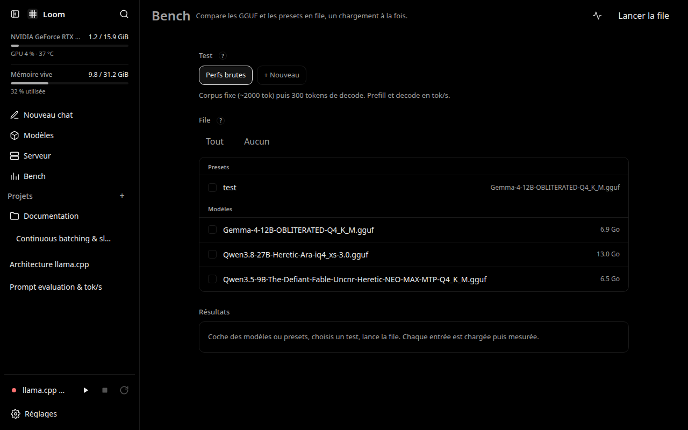

<div align="center">
  
  <h1>Loom</h1>
  <p><strong>A local-first AI workspace, powered by llama.cpp.</strong></p>

  <p>
    <a href="LICENSE"></a>
    
    
    
    
  </p>

  
</div>

## Overview

Loom is a conversation-first AI workspace: the discussion and its explicit project context stay together when you switch between local models, cloud APIs and harnesses. Local manages GGUFs, the download Hub and the engine; Cloud manages providers and their model lists. Harnesses manages native configurations and ACP adapters for Codex, Claude Code, Pi and Gemini. Antigravity uses its own discovered account catalog and experimental text bridge. Interactive terminals are not implemented. See [runtime actions](#runtime-actions) for capabilities and prerequisites.

Loom operates **one** owned `llama-server` instance and preserves its existing model library, settings, continuous batching and benchmarking. Local inference stays on the workstation. Explicitly selecting a cloud destination allows the discussion text and selected project instructions/skills to be sent there; Hub, downloads and updates also use the network when requested.

Instead of forking or vendoring llama.cpp, Loom pilots `llama-server` as an external process. You can point Loom at an existing binary on your machine or let Loom clone and build upstream llama.cpp directly.

The built-in OpenAI-compatible `/v1` proxy exposes `/v1/chat/completions` and `/v1/models` with automatic request-time model switching. It starts `llama-server` with 4 parallel slots by default (`-np 4`), providing native continuous batching so multiple concurrent applications (such as TraDoc, IDE extensions, or agent workflows) can execute in parallel without queue serialization or manual server restarts.

## Interface

The sidebar includes Local, Cloud, Harnesses, Ressources, Bench and Usage, alongside discussions, projects and Settings. A common execution selector controls the next reply in a discussion. The side panel shows runtime-specific controls and shared context. Local has Library, Hub and Engine & API tabs; Cloud manages provider connections and model visibility. Shared skills and MCP definitions live in Ressources.

Discussions use the original chat and composer, with complete native local parameters, cloud connection/context or harness configuration in the side panel. Local replies use the rich conversation pipeline (files, tools, reasoning, presets and compaction). Cloud transfers carry **text only**; native attachments, tool state and private reasoning stay local. Returning a common thread to local appends its portable turns to a native archive while retaining the original source archive. Cloud keys stay in server memory unless you choose to remember them in the operating system's keychain. See the [context and adapter boundaries](docs/workspace-architecture.md).

The common discussion's context section lets you rename it, attach or detach a project and add instructions without rewriting exchanged messages. **View prepared text** previews its portable instructions/history and draft without contacting a model or saving the draft. Cloud sends and common-context edits reject stale revisions. Native local replies retain their existing prompt, tool and compaction processing; the portable preview is not a full native wire dump. Byte limits are not model token-window estimates.

Environment is available through the control-key protected `/api/env/*` APIs:
declare services, opt into Docker observations per local/SSH machine, link
Proxmox with a token in the OS keychain and an explicitly confirmed certificate
pin when needed, and check HTTP/TCP reachability or a bounded machine matrix.
There is no Environment UI yet. See the [Environment API](docs/architecture.md#environment-api-roadmap-step-6)
for payloads, activation and limits.

### Cloud connections

In **Cloud**, create a connection using the OpenAI, OpenRouter or Mistral URL preset, or a custom **Chat Completions-compatible** endpoint. Enter its API key and explicitly request **Verify and retrieve models**: this sends the key only to that destination's `/models` endpoint, without sending a conversation or generating a reply. Choose up to 32 model IDs to save; manual IDs remain available when catalog discovery is unsupported. A returned catalog does not guarantee chat compatibility, account access or quota. The usage-reporting option can be disabled for providers that reject `stream_options`.

Use **Cloud** to choose which saved models appear in discussions. Selecting one in the original model picker confirms the destination before sharing portable text/context. The same discussion continues, with model attribution and token usage when reported. Without keychain storage, reconnect the key after a restart. Remembered keys are restored from the OS keychain when available; otherwise reconnect in Cloud. Sending requires an available key. Keys are not saved in the Loom database or browser storage. These presets do not implement Anthropic's native API, Responses-only models or arbitrary provider protocols.

### Mobile and installed app

The interface retains its original chat and parameters, with responsive workspace pages, scrollable dialogs, larger touch targets and safe-area handling. The application exposes a PWA manifest; installation depends on the browser offering it. Installation/service workers require HTTPS, except for browser-recognized loopback development origins; plain LAN HTTP can show the interface but is not an installable-PWA guarantee.

The service worker caches only a public offline fallback and listed icons. It does **not** cache conversations, credentials, API traffic or the application document. Offline sends preserve the draft and are not queued or retried automatically. An already-open interface may remain visible, but offline chat or durable offline drafts are not provided. Existing push behavior is retained. See [service-worker security requirements](https://developer.mozilla.org/en-US/docs/Web/API/Service_Worker_API).

The screenshots below document the existing inference controls; the workspace shell has since evolved. See the [architecture audit and first implementation](docs/workspace-architecture.md).

| Chat & Parameters | OpenAI `/v1` Server Dashboard |
| --- | --- |
| Responsive chat with thinking/reasoning inspection and a three-tier parameter tuning panel (Essentials, Advanced, Expert). | Real-time slots monitoring, live token throughput (tok/s), active/queued request states, and completion history. |
|  |  |

| Model Library & Hub | Hardware Test Bench |
| --- | --- |
| Local GGUF catalog, preset editor, and direct Hugging Face repository catalog with VRAM sizing estimates. | Standardized prompt tests and raw prefill/decode throughput benchmarking to measure hardware speed. |
|  |  |

## Highlights

- **External process orchestration**: Pilots `llama-server` as a clean external subprocess without modifying upstream source code.
- **Antigravity text bridge**: Opt-in `agy` catalog and streaming CLI turns in the original discussion, with shared text context, cancellation, native session IDs and reported tokens. Each turn starts fresh; native permissions/configuration remain in force, without Loom adding auto-approval. This is not a full tool/approval or private-memory integration.
- **Usage and quotas**: A closable composer sheet reads Antigravity/Codex account limits on request, shows available reset counts when reported, and summarizes retained Loom turns. API costs use manually entered indicative prices, not account billing; unknown values never become zero. No reset credit is redeemed.
- **Reasoning and response provenance**: Antigravity reasoning variants share one picker entry; the composer selects a discovered native level without sending a message. Past responses retain their runtime/model, reported tokens and duration; native tool status and bounded write targets are collapsible. Local responses retain llama.cpp decode metrics and show “No API cost”, not free electricity or hardware. Hidden reasoning text is not reconstructed.
- **Project context**: Group discussions with shared instructions, a working-directory reference and explicitly selected reusable skills. No directory contents are read automatically.
- **Continuous batching**: Native multi-slot parallel inference (`-np 4` default), allowing multiple client tools to query the engine concurrently without serialization.
- **OpenAI `/v1` proxy**: Standard `/v1/chat/completions` and `/v1/models` endpoints with on-demand model loading and runtime parameter overlays.
- **Three-tier parameter control**: Customize context windows, GPU layers, reasoning effort and KV cache. Curated controls come from a versioned JSON catalogue; Expert follows the installed `llama-server --help`. The authenticated, read-only `/api/engine/params` endpoint merges both without changing saved configuration.
- **VRAM estimation**: Calculates expected KV and compute VRAM requirements against total GPU memory before loading.
- **Model Library & Hugging Face Hub**: Search, inspect, and download GGUF models directly to local disk with download resume and progress tracking.
- **Hardware test bench**: Benchmark prompt completion times and raw token generation speed (prefill tok/s, decode tok/s) across models and presets.
- **Local-first inference**: llama.cpp prompts and completions stay on the workstation. Explicit cloud/harness selection shares portable text with that destination; optional Hub searches/downloads use the network. Loom adds no telemetry.

## Quick start

### Release installers

The checked-in [changelog](CHANGELOG.md) records no published release yet.
Until verified binaries and checksums are published, use the source build below.
The following installer commands are for a published release.

Review the installer before running it. It selects the binary for your platform and verifies it against the release's SHA-256 manifest. On Linux and macOS, it also configures system services with elevated privileges. See [RELEASING.md](RELEASING.md) for the maintainer's release process.

On Linux and macOS:

```bash
curl -fsSL https://raw.githubusercontent.com/lucas-lepajollec/loom/main/install.sh -o loom-install.sh
# Review loom-install.sh before continuing.
sh loom-install.sh
```

On Windows (PowerShell):

```powershell
Invoke-WebRequest https://raw.githubusercontent.com/lucas-lepajollec/loom/main/install.ps1 -OutFile loom-install.ps1
# Review loom-install.ps1 before continuing.
.\loom-install.ps1
```

The installers stop if the matching release binary or checksum is missing; they do not silently build different source code instead.

---

### Building from source

If you prefer to build from source:

- Go 1.25 or later
- GNU Make

Node is needed only for `make check-ui`; the native ES-module UI has no build
step. Local inference also requires a working `llama-server`, linked or installed
from Settings → Engine. Building llama.cpp itself requires its native toolchain
(Git, CMake and a C/C++ compiler).

```bash
git clone https://github.com/lucas-lepajollec/loom.git
cd loom
make build
./bin/loom web 8091
```

### Run the web interface

```bash
./bin/loom web 8091
```

Open [http://127.0.0.1:8091](http://127.0.0.1:8091) in your browser.

### Link your llama-server engine

In the Web UI, open **Settings → Engine** (or run `./bin/loom edit` via CLI):
- Set `BIN=/path/to/llama-server`
- Configure your local model directories
- Select a model in the library to start serving immediately

## Configuration and persistence

- **Data directory**: Set `$LOOM_HOME` to choose the runtime data root. Otherwise Loom reads `/etc/default/loom` when present, then uses `$XDG_DATA_HOME/loom` or `~/.local/share/loom` on Unix; Windows uses `%ProgramData%\loom`, falling back to `%LOCALAPPDATA%\loom` or the temporary directory. Models may also live in explicitly configured external directories.
- **Configuration**: Persisted in `$LOOM_HOME/loom.db` (bbolt), alongside chats and preferences. Change settings through the UI or `./bin/loom edit`; legacy `config.env` files may be imported during migration. MCP servers are stored separately in editable `$LOOM_HOME/mcp.json` (`mcpServers`, with per-server `enabled` and `disabledTools`), with atomic private-file writes, automatic reload and recovery from invalid edits. Existing Claude Code, Cursor, standard MCP and VS Code files can be linked read-only and explicitly adopted disabled; see [MCP files and API](docs/mcp-files.md).
- **Development environment**: Loom loads `.env.local` and `.env` from its current working directory, filling unset environment variables. `.env.local` takes precedence over `.env`; exported variables take precedence over both. Keep runtime data in ignored `.project-local/` when developing in this repository.
- **Model discovery**: Recursively indexes all `.gguf` files within declared model directories and the directory containing the `llama-server` binary.
- **Brain context service**: Local file sources, existing discussions and memory pages share a lexical index, cited context packs with an explicit token budget, authenticated `/api/brain/*` routes and a read-only Streamable HTTP MCP endpoint at `/mcp/brain`. Personal sources require both explicit IDs and opt-in. The Loom process serves harnesses with the browser closed; see [Brain sources, API and harness setup](docs/brain.md).

## Security, privacy, and limitations

> [!WARNING]
> Do not expose Loom or its OpenAI `/v1` endpoint directly to the public internet without an authenticated TLS reverse proxy.

- **Loopback binding**: Loom binds to `127.0.0.1` by default.
- **LAN access**: The OpenAI front can be exposed intentionally; Loom requires an API key before enabling that mode. The web UI remains on loopback by default and uses a separate web key.
- **Single owned process**: Loom manages one `llama-server`. A router-capable engine stays running while models load/unload through its API; `ENGINE_MODE=single` or older engines use the legacy process-replacement path.
- **Explicit destination**: local inference stays local. Selecting a cloud model requires confirmation before the conversation and selected context are sent to that provider. No telemetry. Never put credentials in project instructions or skills.

## Architecture

| Component | Implementation |
| --- | --- |
| Core daemon & proxy | Go 1.25+, bbolt embedded database |
| Web dashboard | Native ES modules with vendored Preact + htm; `internal/loom/ui/next` embedded directly in the Go binary, served at `/` and `/next/` |
| Workspace layer | Portable conversation records, per-turn runtime attribution, local/cloud adapters, model/provider catalog, explicit project context and skills |
| Inference backend | Standalone external `llama-server` subprocess |
| Web UI / control port | `8091` (`http://127.0.0.1:8091`) |
| OpenAI-compatible front | `8081` (`http://127.0.0.1:8081/v1`) |
| Managed llama-server backend | `18081` by default, loopback-only and derived from the front port |

```text
cmd/loom/          # Main application entry point and Windows resource metadata
internal/loom/     # Daemon, OpenAI /v1 proxy, process orchestration, and embedded UI
tools/gen-icon/    # Icon generator used by go generate ./cmd/loom
docs/              # Visual assets and architecture documentation
```

Read [architecture principles](docs/architecture-principles.md), the
[architecture and migration plan](docs/architecture.md), and
[workspace contracts](docs/workspace-architecture.md). The package diagram is a
target layout; the migration notes identify the packages already extracted.

## Development and quality

| Command | Purpose |
| --- | --- |
| `make help` | List all Makefile targets |
| `make build` | Embed the UI directly and compile `bin/loom` |
| `make test` | Run Go test suite (`go test ./...`) |
| `go test -short ./...` | Run the Go suite in short mode (also used by CI) |
| `go vet ./...` | Vet all Go packages |
| `make web` | Run the web server in foreground on port 8091 |
| `make check-ui` | Syntax-check the UI modules and run the UI tests |

For a separate development data directory and port:

```bash
LOOM_HOME="$PWD/.project-local/runtime" LOOM_SERVICE=loom-dev-engine \
LOOM_UI_SERVICE=loom-dev-ui ./bin/loom web 2594
```

Go HTTP integration tests require local TCP sockets, including in short mode.

## Interactive demo

The [browser-only demo](https://demo.loom.lucas-homelab.fr) simulates Loom with fictional data. It needs no GPU, model, daemon, or account, and does **not** perform inference. The actual workstation product runs locally.

## Documentation and community

- [User documentation](https://docs.loom.lucas-homelab.fr)
- [Contributing guide](CONTRIBUTING.md)
- [Changelog](CHANGELOG.md)
- [Security policy](SECURITY.md)
- [Support](SUPPORT.md)
- [Code of Conduct](CODE_OF_CONDUCT.md)
- [MIT License](LICENSE)

Third-party dependencies and llama.cpp retain their respective licenses and terms.

## Runtime actions

The workspace runtime catalog comes from one ordered adapter registry. Descriptors
include their description, native CLI, connection consent text and implemented
capabilities. Codex, Claude Code, Pi and Gemini now have ACP adapters, available
when their registry launcher and native detection binaries are installed. Hermes
remains a planned entry without executable capabilities.

Harness installation and updates are available through the control API on this
machine or a saved SSH machine. `GET /api/harness/lifecycle?target=local&id=codex`
reports versions and missing tools; `POST /api/harness/lifecycle` accepts
`{"target":"local","id":"codex","action":"install"}` (also `check` or `update`).
`POST /api/harness/lifecycle/auto` with `{target,id,auto:true}` opts that pair into
six-hour checks and updates while its discussions are idle. The latest automatic
result is retained. Existing remote linking uses `/api/machines`; the runtime
update endpoint remains compatible. See the [lifecycle API](docs/architecture.md#harness-lifecycle-api)
for OS commands, unknown version handling and upstream limitations. macOS builds
without CGO keep the CLI/web server but have no menu-bar icon. Pi's requested
npm package is marked unverified; Antigravity has no automatic latest-version source.

Explicit native catalog connection uses `POST /api/runtimes/{id}/connect` with
`{"consent":true}`. Explicit quota reading uses `POST /api/runtimes/{id}/quota`
with `{}`. Both retain the control API's authentication, private-cache and vault
boundaries. Quota reads share the existing 30-second throttle/cache and never
start generation or consume reset credits. The Antigravity connect route and
`/api/usage/refresh` remain aliases. Codex app-server now reads quotas only;
its old catalog-connect alias reports that connection discovery is unsupported. See
[workspace contracts](docs/workspace-architecture.md#runtime-registry-and-optional-actions).


ACP discussions require an existing absolute workdir before sending. Session
configuration, approval routing, confined fs writes/diffs and ordered display
events are available over the control API. `LOOM_DEV_FAKE_ACP=1` enables a
scripted agent that exercises this path without model calls. Native session
resumption is negotiated and requires compatible portable context. See the
[ACP API and lifecycle notes](docs/agents/acp-implementation.md) and
[roadmap](docs/ROADMAP.md) for shared-resource bindings and remaining work.


## Security, data and engine settings

Settings → Security and data supports masked password/recovery-key unlock,
locking, confirmed decryption, and adding/replacing an additional vault key.
Encryption displays its recovery key once; keep it offline. Local snapshots
restore only memory files and the vault, with a safety snapshot first; they do
not restore discussions, presets or settings. Snapshot sizes remain unknown.
General settings enables Web Push only in supported secure browser contexts.
Engine settings selects GPUs for the active model using its binary's native
identifiers and saves `EXTRA_ARGS --device` in the preset or remembered model
before confirmed application. Unknown/single GPU lists are read-only. Local
Library's up/down preset buttons save the complete order, including hidden
filtered entries. Multi-GPU split (`--tensor-split`, `--split-mode`) is set
through the Expert parameters of a model.

## Inspecting models and automatic local settings

Click a model name in Local or Cloud, or a harness/name in Harnesses, to open
its contextual drawer. Local models and presets expose their parameter editor;
cloud/harness selections show declared connection, model and capability data.
Inspection alone does not load a model, connect an account or change a chat.

Bare local loads leave context/GPU layers automatic and use `--fit on` when
advertised by the installed engine. Explicit settings and remembered values
remain effective; older builds retain the historical defaults. The pre-load
VRAM estimate is advisory. After router loading, the inspector shows observed
context per slot when available, otherwise “—”; this is distinct from the native
model limit. See [native fitting documentation](https://github.com/ggml-org/llama.cpp/blob/master/tools/server/README.md).
