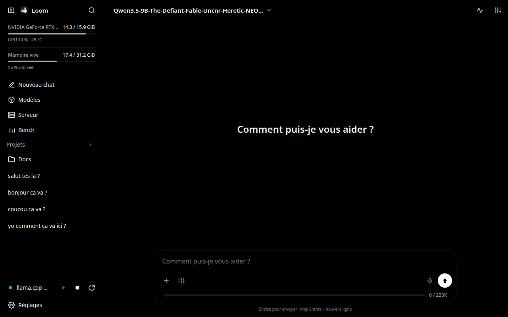
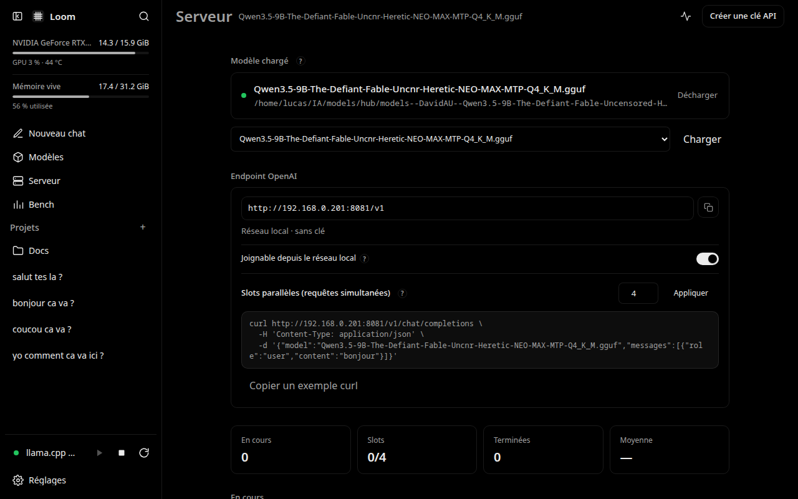
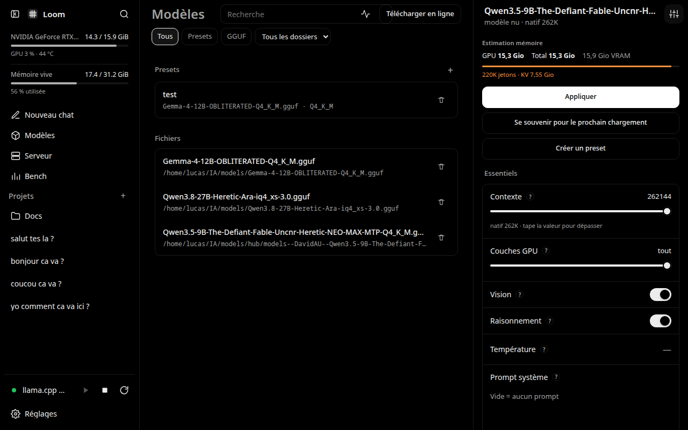

<div align="center">
  
  <h1>Loom</h1>
  <p><strong>Workstation control plane, OpenAI-compatible proxy, and test bench for llama.cpp.</strong></p>

  <p>
    <a href="LICENSE"></a>
    
    
    
    
  </p>

  
</div>

## Overview

Loom operates **one** owned `llama-server` instance and provides an elegant local web interface, automated continuous batching across parallel slots, performance benchmarking, local model library management, and strict local-only data isolation.

Instead of forking or vendoring llama.cpp, Loom pilots `llama-server` as an external process. You can point Loom at an existing binary on your machine or let Loom clone and build upstream llama.cpp directly.

The built-in OpenAI-compatible `/v1` proxy exposes `/v1/chat/completions` and `/v1/models` with automatic request-time model switching. It starts `llama-server` with 4 parallel slots by default (`-np 4`), providing native continuous batching so multiple concurrent applications (such as TraDoc, IDE extensions, or agent workflows) can execute in parallel without queue serialization or manual server restarts.

## Product preview

The Loom web interface provides complete control over local inference, model configuration, and server throughput.

| Chat & Parameters | OpenAI `/v1` Server Dashboard |
| --- | --- |
| Responsive chat with thinking/reasoning inspection and a three-tier parameter tuning panel (Essentials, Advanced, Expert). | Real-time slots monitoring, live token throughput (tok/s), active/queued request states, and completion history. |
|  |  |

| Model Library & Hub | Hardware Test Bench |
| --- | --- |
| Local GGUF catalog, preset editor, and direct Hugging Face repository catalog with VRAM sizing estimates. | Standardized prompt tests and raw prefill/decode throughput benchmarking to measure hardware speed. |
|  |  |

## Highlights

- **External process orchestration**: Pilots `llama-server` as a clean external subprocess without modifying upstream source code.
- **Continuous batching**: Native multi-slot parallel inference (`-np 4` default), allowing multiple client tools to query the engine concurrently without serialization.
- **OpenAI `/v1` proxy**: Standard `/v1/chat/completions` and `/v1/models` endpoints with on-demand model loading and runtime parameter overlays.
- **Three-tier parameter control**: Customize context windows, GPU layers, reasoning effort, KV cache, and every native `llama-server` flag.
- **VRAM estimation**: Calculates expected KV and compute VRAM requirements against total GPU memory before loading.
- **Model Library & Hugging Face Hub**: Search, inspect, and download GGUF models directly to local disk with download resume and progress tracking.
- **Hardware test bench**: Benchmark prompt completion times and raw token generation speed (prefill tok/s, decode tok/s) across models and presets.
- **100% offline & local-first**: Zero telemetry, zero external dependencies, all state preserved locally in `$LOOM_HOME`.

## Quick start

### Prerequisites

- Go 1.24 or later
- GNU Make
- A local build of `llama-server` (from [llama.cpp](https://github.com/ggml-org/llama.cpp))

### 1. Build Loom

```bash
git clone https://github.com/lucas-lepajollec/loom.git
cd loom
make build
```

This compiles the embedded web UI and produces the standalone binary in `bin/loom`.

### 2. Run the web interface

```bash
./bin/loom web 8091
```

Open [http://127.0.0.1:8091](http://127.0.0.1:8091) in your browser.

### 3. Link your llama-server engine

In the Web UI, open **Settings → Engine** (or run `./bin/loom edit` via CLI):
- Set `BIN=/path/to/llama-server`
- Configure your local model directories
- Select a model in the library to start serving immediately

## Configuration and persistence

- **Data directory**: All configuration, presets, chats, and downloads are persisted in `$LOOM_HOME` (defaults to `~/.local/share/loom` or `$XDG_DATA_HOME/loom`).
- **Configuration file**: Stored in `$LOOM_HOME/config.json`. Can be edited in the UI or via `./bin/loom edit`.
- **Development environment**: Loom automatically loads `.env.local` or `.env` from the project root if present, allowing local overrides without editing tracked files.
- **Model discovery**: Recursively indexes all `.gguf` files within declared model directories and the directory containing the `llama-server` binary.

## Security, privacy, and limitations

> [!WARNING]
> Do not expose Loom or its OpenAI `/v1` endpoint directly to the public internet without an authenticated TLS reverse proxy.

- **Loopback binding**: Loom binds to `127.0.0.1` by default.
- **LAN access**: When exposing the service to your local network, always set an API key in **Settings → Server API**.
- **Single owned process**: Loom manages exactly one running `llama-server` process at a time; loading a new model safely unloads and replaces the resident instance.
- **Strict local isolation**: Loom never sends prompts, completions, telemetry, or user data to external cloud servers.

## Architecture

| Component | Implementation |
| --- | --- |
| Core daemon & proxy | Go 1.24+, bbolt embedded database |
| Web dashboard | Single-page UI (HTML5, modern CSS, ES modules) assembled into Go binary |
| Inference backend | Standalone external `llama-server` subprocess |
| Default UI / API port | `8091` (`http://127.0.0.1:8091`) |
| Engine backend port | `8081` (`http://127.0.0.1:8081`) |

```text
cmd/loom/          # Main application entry point and Windows resource metadata
internal/loom/     # Daemon, OpenAI /v1 proxy, process orchestration, and embedded UI
tools/             # Build scripts and single-page asset assembler
docs/              # Visual assets and architecture documentation
```

## Development and quality

| Command | Purpose |
| --- | --- |
| `make build` | Assemble web UI assets and compile `bin/loom` |
| `make test` | Run Go test suite (`go test ./...`) |
| `make web` | Run the web server in foreground on port 8091 |
| `make assemble-ui` | Reassemble `internal/loom/ui/index.html` from `internal/loom/ui/src/` |

## Public demo

Loom is a local workstation control plane that manages physical hardware, GPU layers, and local subprocesses. Because it requires direct access to host GPU hardware and local model weights, there is no remote hosted public demo. All capabilities can be evaluated locally by following the [Quick start](#quick-start).

## Documentation and community

- [Contributing guide](CONTRIBUTING.md)
- [Changelog](CHANGELOG.md)
- [Security policy](SECURITY.md)
- [Support](SUPPORT.md)
- [Code of Conduct](CODE_OF_CONDUCT.md)
- [MIT License](LICENSE)

Third-party dependencies and llama.cpp retain their respective licenses and terms.
